# edc-airflow-spark-on-k8s
Engenharia de Dados em Cloud - ETL - Airflow e Spark Operator no Kubernetes - Google Kubernetes Engine
## Objetivo:
Este projeto tem como objetivo documentar de forma didática as etapas necessárias para criar de um Cluster Kubernetes ("**k8s**") e realizar o *deploy* do *Airflow* e *Spark-Operator* neste mesmo cluster. Disponibilizando assim uma ambiente escalavel para processamento de dados e orquestração de pipelines, sendo plenamente aplicavél em um contexto de *Big Data*. 

<br>

Links de referência deste projeto:
- "edc-igti-terraform-ias-mod1"
    - https://github.com/smedina1304/edc-igti-terraform-ias-mod1
        <br>
        *Forked from:* [neylsoncrepalde/edc-mod1-exercise-igti](https://github.com/neylsoncrepalde/edc-mod1-exercise-igti)<br>
        
        <br>
- "edc-igti-kafka-k8s-mod2"
    - https://github.com/smedina1304/edc-igti-kafka-k8s-mod2
        <br>
        *Forked from:* [carlosbpy/igti-k8s-exercise](https://github.com/carlosbpy/igti-k8s-exercise)<br>
        
        <br>
- "edc-igti-spark-mod3"
    - https://github.com/smedina1304/edc-igti-spark-mod3
        <br>
        *Forked from:* [pltoledo/dad-mod2-igti](https://github.com/pltoledo/dad-mod2-igti)<br>
        
        <br>
- "edc-igti-kubernetes-mod4"
    - https://github.com/smedina1304/edc-igti-kubernetes-mod4
        <br>
        *Forked from:* [neylsoncrepalde/edc_mod4_exercise_igti](https://github.com/neylsoncrepalde/edc_mod4_exercise_igti)<br>
        
        <br>
- "edc-etl-dags-prefect-io"
    - https://github.com/smedina1304/edc-etl-dags-prefect-io
        <br>
        
<br>


## Preparação do ambiente Python:

- Versão da Linguagem Python 3.8 ou superior deve estar instalada.
    <br>
    ```shell
    > python --version
        Python 3.8.2
    ```
    <br>

    :point_right: *Atenção: verificar se o seu python versão 3 está respondendo com o comando **python** ou **python3**.*
    <br>

- Clonar o repositório deste projeto na sua máquina de desenvolvimento, para esta ação via linha de comando selecione a pasta que recebera o projeto e execute o comando `git`, caso prefeira outro procedimento esta ação é livre:
    <br>

    ```shell
    > git clone https://github.com/smedina1304/edc-airflow-spark-on-k8s.git
    ```
    <br>

    :point_right: *Verificar se após o comando a criação da pasta `edc-airflow-spark-on-k8s` foi realizada corretamente.*


- Criando o ambiente virtual Python **`venv`**, para isolar e controlar o versionamento de pacotes a ser utilizado. A criação do ambiente virtual deve ser realizado na pasta *root* do projeto.
    <br>

    ```shell
    > python -m venv venv
    ```
    <br>

- Para ativar o ambiente **`venv`**:
    <br>

    - Linux e Mac:
    ```shell
    > source .venv/bin/activate
    ```    
    <br>

    - Windows:
        <br>

        - No Windows via Powershell utilizar "`activate.bat`".
        <br>

        ```shell
        > .\venv\Scripts\Activate.ps1
        ```
        <br>

        - No Windows via CMD utilizar "`activate.bat`".
        <br>

        ```shell
        > .\venv\Scripts\activate.bat
        ```
    <br>
        
    :point_right: *Atenção: Para verificar que está funcionando e o ambiente foi ativado, deve aparecer o nome do ambiente destacado com prefixo do seu prompt de comandos.*
    <br>
    - Conforme abaixo:
    <br>

    ```shell
    (venv)
    ```
    <br>


- Para desativar o ambiente **`venv`**:
    <br>

    ```shell
    > deactivate
    ```
    <br>

    :point_right: *Atenção: Este comando deve ser usado apenas quando não mais for necessário execução de códigos python no ambiente virtual.*
    <br>

- Instalação de pacotes requeridos para o projeto, para isso pode ser verificado o arquivo `requirements.txt` na pasta `root` do projeto.
    <br>

    Passo opcional para atualização do `pip` no ambiente **`venv`**:

    ```shell
    > pip install --upgrade pip
    ```
    <br>

    Passo de instalação dos pacotes via arquivo *`requirements.txt`*:
    ```shell
    > pip install -r requirements.txt
    ```
    <br>

    :point_right: *Obervação: todos os pacotes necessário para executar os pipelines (DAGs) deste projeto estão contidas  no arquivo em `requirements.txt`.*
    <br>
    <br>

## Requisitos de ferramentas CLI (Command line):
<br>

A utilização de ferramentas via CLI (*"command line"*) é importante pois podemos definir os scripts de criação, preparação de deploy em nosso ambiente k8s, deixando o mesmo facilmente de ser replicavel em outra estrutura se necessário, e até mesmo em um caso de um acelerador para um "disaster recovery".
<br>

- Recursos indicados:
    <br>

    - Ambiente AWS, seguir as instruções da página conforme o sistema operaiconal desejado:
        - AWS CLI version 2 - https://docs.aws.amazon.com/cli/latest/userguide/install-cliv2.html 
        <br>

    - Ambiente GCP, seguir as instruções da página conforme o sistema operaiconal desejado:
        - Google Cloud SDK Command Line (CLI) - https://cloud.google.com/sdk/docs/quickstart
        <br>
        :point_right: *Importante: realize todos os passos de preparação do ambiente Google Cloud SDK conforme a página Quickstart.*
        <br>     

   - EKS para interação com o cluster Kubernetes - eksctl - https://docs.aws.amazon.com/eks/latest/userguide/eksctl.html
      - Também deve ser verificado de juntamente com o eksctl foi instalando kubectl, caso contrário verificar o procedimento em: https://docs.aws.amazon.com/eks/latest/userguide/install-kubectl.html
      <br>

   - HELM - repositório de pacotes para deploy no k8s - https://helm.sh/docs/intro/install/
    <br>

   - kubectx - para alterar o contexto o cluster k8s, em caso de haver mais de uma referência na máquina utilizada para operação - https://github.com/ahmetb/kubectx
    <br>

- Verificar as instalações:
   ``` shell
    > aws --version
    aws-cli/2.2.31 Python/3.8.8 Darwin/19.6.0 exe/x86_64 prompt/off

    > gcloud --version
    Google Cloud SDK 358.0.0
    bq 2.0.71
    core 2021.09.17
    gsutil 4.68

    > eksctl version
    0.63.0

    > kubectl version
    Client Version: version.Info{Major:"1", Minor:"22", GitVersion:"v1.22.1", GitCommit:"632ed300f2c34f6d6d15ca4cef3d3c7073412212", GitTreeState:"clean", BuildDate:"2021-08-19T15:38:26Z", GoVersion:"go1.16.6", Compiler:"gc", Platform:"darwin/amd64"}

    > helm version
    version.BuildInfo{Version:"v3.6.3", GitCommit:"d506314abfb5d21419df8c7e7e68012379db2354", GitTreeState:"dirty", GoVersion:"go1.16.6"}

   ```

<br>

:point_right: *Importante: verifique todos os passos de configuração das ferramentas CLI referentes a interação com a AWS e GCP, pois cada uma tem seu padrão de autenticação.*
<br>
<br>


## Criação do Cluster Kubernetes (k8s) em Cloud:

- Google Cloud - GCP.

    - Após instalação do `gcloud`, conforme instruções e o instalador que foi baixado verifique as informações de configuração antes de iniciar a criação do cluster:
        <br>

        ```shell
        > gcloud config list             
        [compute]
        region = us-east1
        zone = us-east1-c
        [core]
        account = sergio.medina
        disable_usage_reporting = True
        project = edc-igti-smedina
        ```

    - Verificando as configurações, o comando para criação do Cluster pode ser executado, como exemplo abaixo:
    <br>

    ```shell

    > gcloud /
    beta container --project "edc-igti-smedina" /
    clusters create "cluster-smedina-k8s" --zone "us-east1-c" /
    --no-enable-basic-auth --cluster-version "1.20.9-gke.1001" /
    --release-channel "regular" --machine-type "e2-standard-2" /
    --image-type "COS_CONTAINERD" --disk-type "pd-standard" /
    --disk-size "100" --node-labels ies=igti,curso=edc /
    --metadata disable-legacy-endpoints=true /
    --scopes "https://www.googleapis.com/auth/compute",/
    "https://www.googleapis.com/auth/devstorage.full_control",/
    "https://www.googleapis.com/auth/taskqueue",/
    "https://www.googleapis.com/auth/bigquery",/
    "https://www.googleapis.com/auth/logging.write",/
    "https://www.googleapis.com/auth/monitoring",/
    "https://www.googleapis.com/auth/servicecontrol",/
    "https://www.googleapis.com/auth/service.management.readonly",/
    "https://www.googleapis.com/auth/trace.append" /
    --max-pods-per-node "110" --num-nodes "6" /
    --logging=SYSTEM,WORKLOAD --monitoring=SYSTEM /
    --enable-ip-alias --network "projects/edc-igti-smedina/global/networks/default" /
    --subnetwork "projects/edc-igti-smedina/regions/us-east1/subnetworks/default" /
    --no-enable-intra-node-visibility --default-max-pods-per-node "110" /
    --enable-autoscaling --min-nodes "4" --max-nodes "6" /
    --no-enable-master-authorized-networks /
    --addons HorizontalPodAutoscaling,HttpLoadBalancing,GcePersistentDiskCsiDriver /
    --enable-autoupgrade --enable-autorepair /
    --max-surge-upgrade 1 /
    --max-unavailable-upgrade 0 /
    --enable-shielded-nodes /
    --node-locations "us-east1-c"

    ```
    *Script: `step-1-cluster/cluster_create.sh`*
    <br>
    *Sintaxe: `https://cloud.google.com/sdk/gcloud/reference/beta/container/clusters/create`*
    <br>

    Abaixo as telas do Console do GPC com as mesmas configurações do comando acima:
    <br>
    <p align="left">
        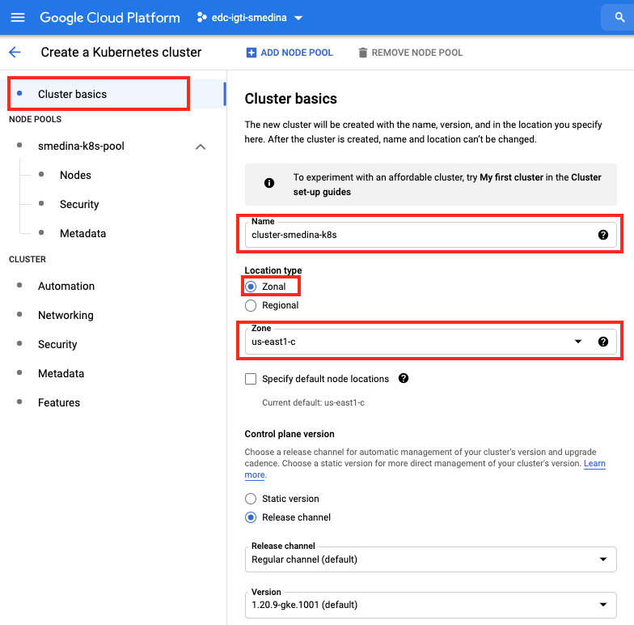
    </p>
    <br>

    <p align="left">
        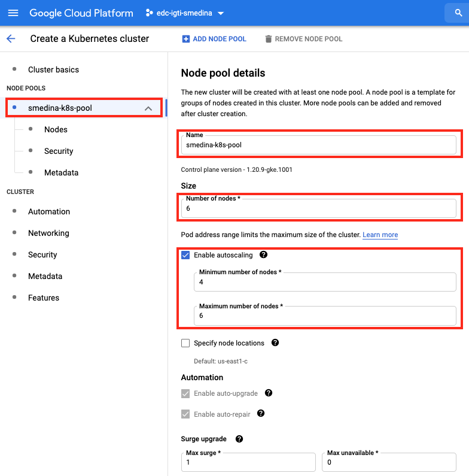
    </p>
    <br>

    <p align="left">
        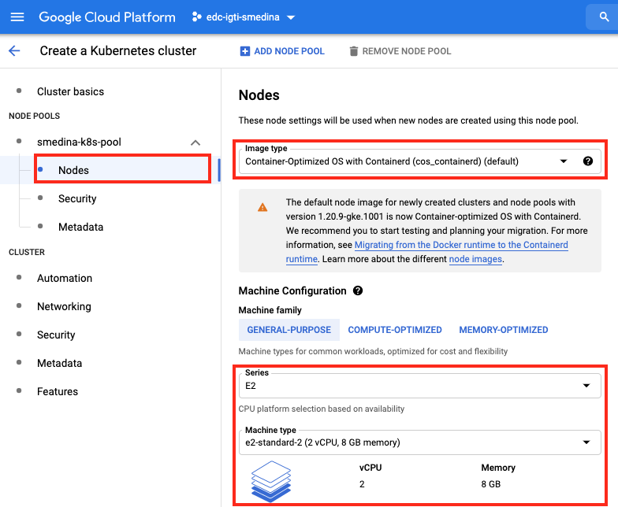
    </p>
    <br>

    <p align="left">
        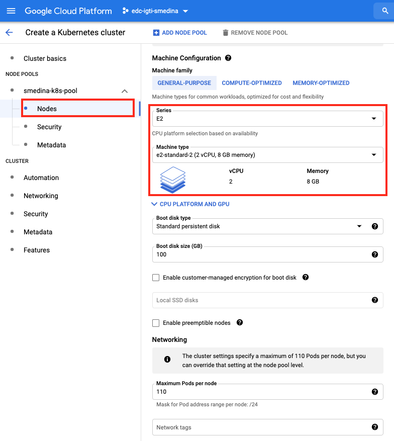
    </p>
    <br>

    <p align="left">
        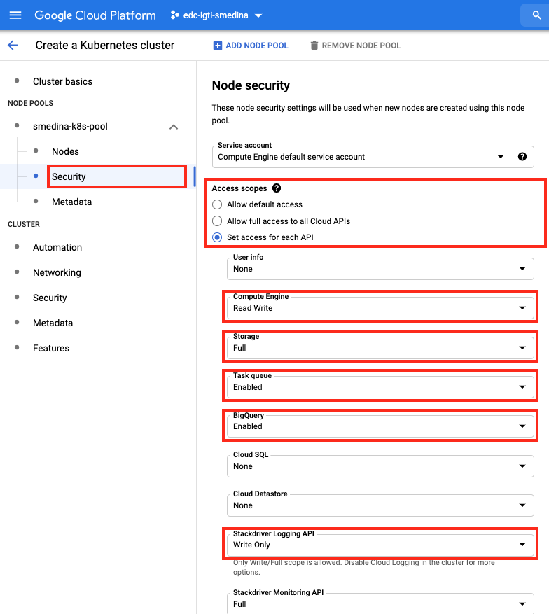
    </p>
    <br>

    <p align="left">
        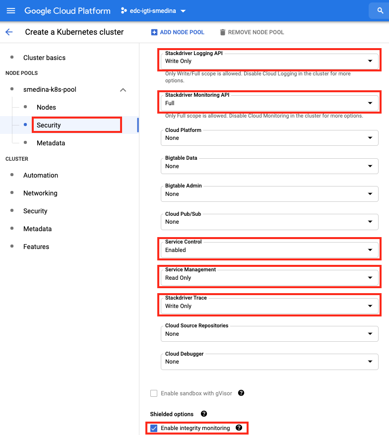
    </p>
    <br>

    <p align="left">
        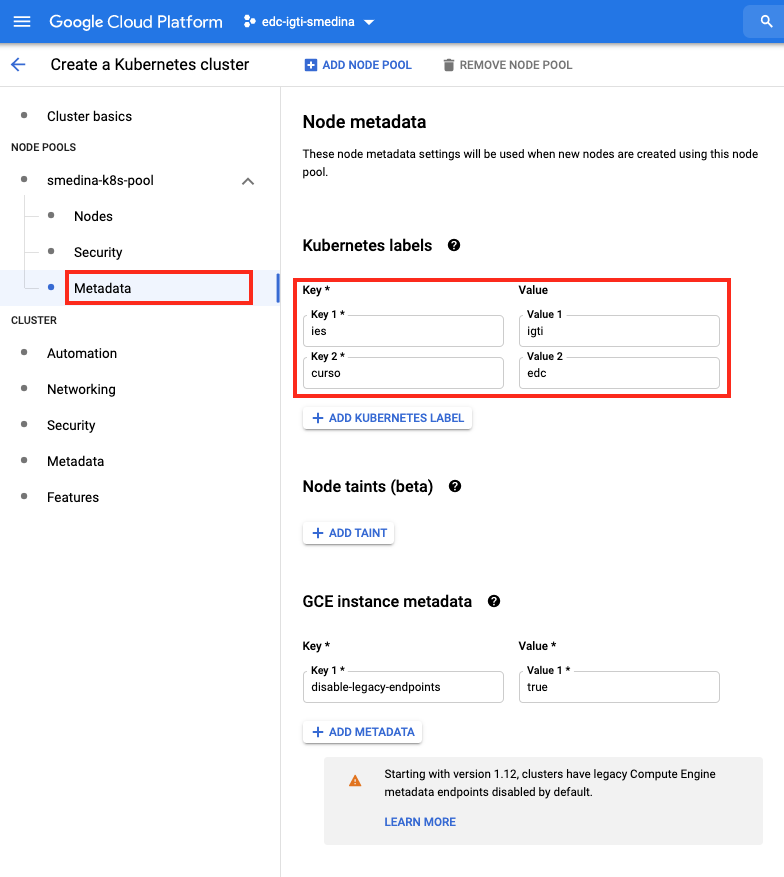
    </p>
    <br>

    <p align="left">
        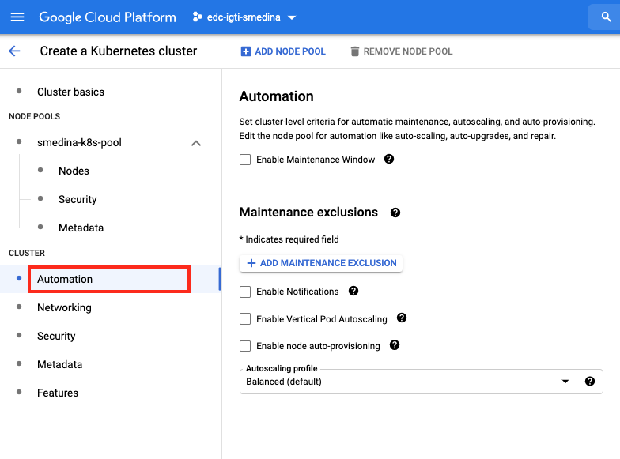
    </p>
    <br>

    <p align="left">
        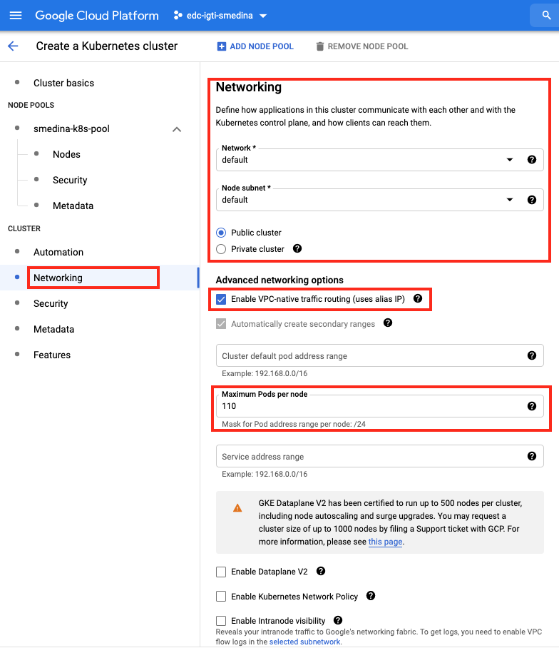
    </p>
    <br>

    <p align="left">
        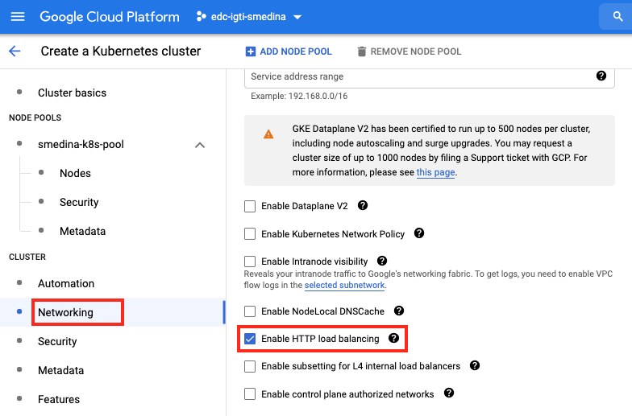
    </p>
    <br>

    <p align="left">
        
    </p>
    <br>

    <p align="left">
        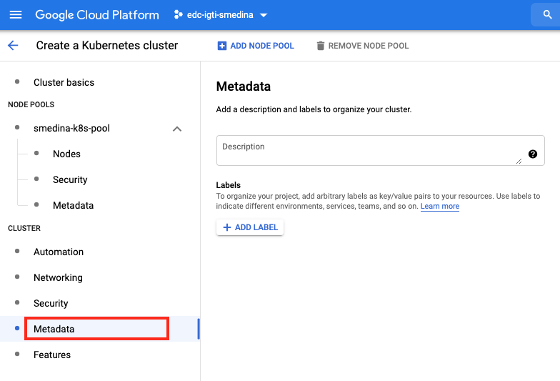
    </p>
    <br>

    <p align="left">
        
    </p>
    <br>

