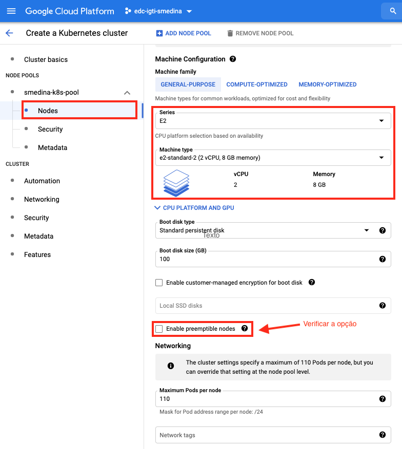

# edc-airflow-spark-on-k8s
Engenharia de Dados em Cloud - ETL - Airflow e Spark Operator no Kubernetes - Google Kubernetes Engine
## Objetivo:
Este projeto tem como objetivo documentar de forma didática as etapas necessárias para criar de um Cluster Kubernetes ("**k8s**") e realizar o *deploy* do *Airflow* e *Spark-Operator* neste mesmo cluster. Disponibilizando assim uma ambiente escalavel para processamento de dados e orquestração de pipelines, sendo plenamente aplicavél em um contexto de *Big Data*. 

<br>

Links de referência deste projeto:
- "edc-igti-terraform-ias-mod1"
    - https://github.com/smedina1304/edc-igti-terraform-ias-mod1
        <br>
        *Forked from:* [neylsoncrepalde/edc-mod1-exercise-igti](https://github.com/neylsoncrepalde/edc-mod1-exercise-igti)<br>
        
        <br>
- "edc-igti-kafka-k8s-mod2"
    - https://github.com/smedina1304/edc-igti-kafka-k8s-mod2
        <br>
        *Forked from:* [carlosbpy/igti-k8s-exercise](https://github.com/carlosbpy/igti-k8s-exercise)<br>
        
        <br>
- "edc-igti-spark-mod3"
    - https://github.com/smedina1304/edc-igti-spark-mod3
        <br>
        *Forked from:* [pltoledo/dad-mod2-igti](https://github.com/pltoledo/dad-mod2-igti)<br>
        
        <br>
- "edc-igti-kubernetes-mod4"
    - https://github.com/smedina1304/edc-igti-kubernetes-mod4
        <br>
        *Forked from:* [neylsoncrepalde/edc_mod4_exercise_igti](https://github.com/neylsoncrepalde/edc_mod4_exercise_igti)<br>
        
        <br>
- "edc-etl-dags-prefect-io"
    - https://github.com/smedina1304/edc-etl-dags-prefect-io
        <br>
        
<br>


## Preparação do ambiente Python:

- Versão da Linguagem Python 3.8 ou superior deve estar instalada.
    
    ```shell
    > python --version
        Python 3.8.2
    ```
    <br>

    :point_right: *Atenção: verificar se o seu python versão 3 está respondendo com o comando **python** ou **python3**.*
    <br>

- Clonar o repositório deste projeto na sua máquina de desenvolvimento, para esta ação via linha de comando selecione a pasta que recebera o projeto e execute o comando `git`, caso prefeira outro procedimento esta ação é livre:

    ```shell
    > git clone https://github.com/smedina1304/edc-airflow-spark-on-k8s.git
    ```
    <br>

    :point_right: *Verificar se após o comando a criação da pasta `edc-airflow-spark-on-k8s` foi realizada corretamente.*


- Criando o ambiente virtual Python **`venv`**, para isolar e controlar o versionamento de pacotes a ser utilizado. A criação do ambiente virtual deve ser realizado na pasta *root* do projeto.

    ```shell
    > python -m venv venv
    ```
    <br>

- Para ativar o ambiente **`venv`**:

    - Linux e Mac:
    ```shell
    > source ./venv/bin/activate
    ```    
    <br>

    - Windows:
        <br>

        - No Windows via Powershell utilizar "`activate.bat`".

        ```shell
        > .\venv\Scripts\Activate.ps1
        ```
        <br>

        - No Windows via CMD utilizar "`activate.bat`".

        ```shell
        > .\venv\Scripts\activate.bat
        ```
    <br>
        
    :point_right: *Atenção: Para verificar que está funcionando e o ambiente foi ativado, deve aparecer o nome do ambiente destacado com prefixo do seu prompt de comandos.*
    <br>
    - Conforme abaixo:

    ```shell
    (venv)
    ```
    <br>


- Para desativar o ambiente **`venv`**:

    ```shell
    > deactivate
    ```
    <br>

    :point_right: *Atenção: Este comando deve ser usado apenas quando não mais for necessário execução de códigos python no ambiente virtual.*
    <br>

- Instalação de pacotes requeridos para o projeto, para isso pode ser verificado o arquivo `requirements.txt` na pasta `root` do projeto.
    <br>

    Passo opcional para atualização do `pip` no ambiente **`venv`**:

    ```shell
    > pip install --upgrade pip
    ```
    <br>

    Passo de instalação dos pacotes via arquivo *`requirements.txt`*:

    ```shell
    > pip install -r requirements.txt
    ```
    <br>

    :point_right: *Obervação: todos os pacotes necessário para executar os pipelines (DAGs) deste projeto estão contidas  no arquivo em `requirements.txt`.*
    <br>

    :point_right: *Atenção: Para ambientes MacOS e para algumas distribuições Linux, mediante a plataforma de Hardware como processador Intel 64bits, pode ser necessário a definição da variavel de ambiente `ARCHFLAGS="-arch x86_64"`. Caso durante a instalação de Pacotes no Python e retornando algum erro, verifique a necessidade de declarar a variavel de ambiente para definição da arquitetura do processador.*

    Definir a variável de ambiente para Mac ou Linux:

    ```shell
        > export ARCHFLAGS="-arch x86_64"
    ```

    Para fazer a instalação do airflow de forma isolada execute o comando:

    ```shell
        > pip install apache-airflow
    ```

    ou pela documentação do pip (https://pypi.org/project/apache-airflow/).

    ```shell
        > pip install apache-airflow==2.1.4 \
        --constraint "https://raw.githubusercontent.com/apache/airflow/constraints-2.1.4/constraints-3.7.txt"
    ```
    <br>

## Requisitos de ferramentas CLI (Command line):
<br>

A utilização de ferramentas via CLI (*"command line"*) é importante pois podemos definir os scripts de criação, preparação de deploy em nosso ambiente k8s, deixando o mesmo facilmente de ser replicavel em outra estrutura se necessário, e até mesmo em um caso de um acelerador para um "disaster recovery".
<br>

- Recursos indicados:
    <br>

    - Ambiente AWS, seguir as instruções da página conforme o sistema operaiconal desejado:
        - AWS CLI version 2 - https://docs.aws.amazon.com/cli/latest/userguide/install-cliv2.html 
        <br>

    - Ambiente GCP, seguir as instruções da página conforme o sistema operaiconal desejado:
        - Google Cloud SDK Command Line (CLI) - https://cloud.google.com/sdk/docs/quickstart
        <br>
        :point_right: *Importante: realize todos os passos de preparação do ambiente Google Cloud SDK conforme a página Quickstart.*
        <br>     

   - EKS para interação com o cluster Kubernetes - eksctl - https://docs.aws.amazon.com/eks/latest/userguide/eksctl.html
      - Também deve ser verificado de juntamente com o eksctl foi instalando kubectl, caso contrário verificar o procedimento em: https://docs.aws.amazon.com/eks/latest/userguide/install-kubectl.html
      <br>

   - HELM - repositório de pacotes para deploy no k8s - https://helm.sh/docs/intro/install/
    <br>

   - kubectx - para alterar o contexto o cluster k8s, em caso de haver mais de uma referência na máquina utilizada para operação - https://github.com/ahmetb/kubectx
    <br>

- Verificar as instalações:

   ``` shell
    > aws --version
    aws-cli/2.2.31 Python/3.8.8 Darwin/19.6.0 exe/x86_64 prompt/off

    > gcloud --version
    Google Cloud SDK 358.0.0
    bq 2.0.71
    core 2021.09.17
    gsutil 4.68

    > eksctl version
    0.63.0

    > kubectl version
    Client Version: version.Info{Major:"1", Minor:"22", GitVersion:"v1.22.1", GitCommit:"632ed300f2c34f6d6d15ca4cef3d3c7073412212", GitTreeState:"clean", BuildDate:"2021-08-19T15:38:26Z", GoVersion:"go1.16.6", Compiler:"gc", Platform:"darwin/amd64"}

    > helm version
    version.BuildInfo{Version:"v3.6.3", GitCommit:"d506314abfb5d21419df8c7e7e68012379db2354", GitTreeState:"dirty", GoVersion:"go1.16.6"}

   ```

<br>

:point_right: *Importante: verifique todos os passos de configuração das ferramentas CLI referentes a interação com a AWS e GCP, pois cada uma tem seu padrão de autenticação.*
<br>
<br>


## Criação do Cluster Kubernetes (k8s) em Cloud:

- Google Cloud - GCP.

    - Após instalação do `gcloud`, conforme instruções e o instalador que foi baixado verifique as informações de configuração antes de iniciar a criação do cluster:

        ```shell
        > gcloud config list             
        [compute]
        region = us-east1
        zone = us-east1-c
        [core]
        account = sergio.medina
        disable_usage_reporting = True
        project = edc-igti-smedina
        ```

    - Criação do Cluster, antes realize as verificações e configurações, estando *"ok"* pode ser executado o exemplo abaixo:
        <br>

        *Sintaxe: `https://cloud.google.com/sdk/gcloud/reference/beta/container/clusters/create`*
        <br>

        ```shell

        > gcloud /
        beta container --project "edc-igti-smedina" /
        clusters create "cluster-smedina-k8s" --zone "us-east1-c" /
        --no-enable-basic-auth --cluster-version "1.20.9-gke.1001" /
        --release-channel "regular" --machine-type "e2-standard-2" /
        --image-type "COS_CONTAINERD" --disk-type "pd-standard" /
        --disk-size "100" --node-labels ies=igti,curso=edc /
        --metadata disable-legacy-endpoints=true /
        --scopes "https://www.googleapis.com/auth/compute",/
        "https://www.googleapis.com/auth/devstorage.full_control",/
        "https://www.googleapis.com/auth/taskqueue",/
        "https://www.googleapis.com/auth/bigquery",/
        "https://www.googleapis.com/auth/logging.write",/
        "https://www.googleapis.com/auth/monitoring",/
        "https://www.googleapis.com/auth/servicecontrol",/
        "https://www.googleapis.com/auth/service.management.readonly",/
        "https://www.googleapis.com/auth/trace.append" /
        --max-pods-per-node "110" --num-nodes "6" /
        --logging=SYSTEM,WORKLOAD --monitoring=SYSTEM /
        --enable-ip-alias --network "projects/edc-igti-smedina/global/networks/default" /
        --subnetwork "projects/edc-igti-smedina/regions/us-east1/subnetworks/default" /
        --no-enable-intra-node-visibility --default-max-pods-per-node "110" /
        --enable-autoscaling --min-nodes "4" --max-nodes "6" /
        --no-enable-master-authorized-networks /
        --addons HorizontalPodAutoscaling,HttpLoadBalancing,GcePersistentDiskCsiDriver /
        --enable-autoupgrade --enable-autorepair /
        --max-surge-upgrade 1 /
        --max-unavailable-upgrade 0 /
        --enable-shielded-nodes /
        --node-locations "us-east1-c"

        ```
        *Script: `step-1-cluster/cluster_create.sh`*
        <br>

        Abaixo as telas do Console do GPC com as mesmas configurações do comando acima:
        <br>
        <p align="left">
            
        </p>
        <br>

        <p align="left">
            
        </p>
        <br>

        <p align="left">
            
        </p>
        <br>

        <p align="left">
            
        </p>
        <br>

        <p align="left">
            
        </p>
        <br>

        <p align="left">
            
        </p>
        <br>

        <p align="left">
            
        </p>
        <br>

        <p align="left">
            
        </p>
        <br>

        <p align="left">
            
        </p>
        <br>

        <p align="left">
            
        </p>
        <br>

        <p align="left">
            
        </p>
        <br>

        <p align="left">
            
        </p>
        <br>

        <p align="left">
            
        </p>
        <br>
        <br>

    - Após a confirmação de termino e criação do cluster k8s, verifique o registro do contexto de acesso e realize uma verificação nos nodes do cluster.
    <br>
    
    Verificando o contexto de acesso.

    ```shell
        > kubectx
        gke_edc-igti-smedina_us-east1-c_cluster-smedina-k8s
    ```

    <br>
    Listando nos Nodes dos Cluster.

    ```shell
        > kubectl get nodes
        NAME                                                 STATUS   ROLES    AGE    VERSION
        gke-cluster-smedina-k8s-default-pool-0bde709b-0vq6   Ready    <none>   5m8s   v1.20.9-gke.1001
        gke-cluster-smedina-k8s-default-pool-0bde709b-2fb6   Ready    <none>   5m8s   v1.20.9-gke.1001
        gke-cluster-smedina-k8s-default-pool-0bde709b-dzt2   Ready    <none>   5m9s   v1.20.9-gke.1001
        gke-cluster-smedina-k8s-default-pool-0bde709b-ksgh   Ready    <none>   5m9s   v1.20.9-gke.1001
        gke-cluster-smedina-k8s-default-pool-0bde709b-vfvh   Ready    <none>   5m8s   v1.20.9-gke.1001
        gke-cluster-smedina-k8s-default-pool-0bde709b-vtvk   Ready    <none>   5m9s   v1.20.9-gke.1001
    ```

    <br>
    
    :point_right: *Atenção: se for necessário deletar o cluster utilize comando abaixo, ou busque uma referência na sintaxe para atender a necessidade.*
    <br>

    *Sintaxe: `https://cloud.google.com/sdk/gcloud/reference/container/clusters/delete`*
    <br>

    ```shell
        > gcloud container clusters delete "cluster-smedina-k8s"
        gcloud container clusters delete "cluster-smedina-k8s"
        The following clusters will be deleted.
        - [cluster-smedina-k8s] in [us-east1-c]

        Do you want to continue (Y/n)?  Y

        Deleting cluster cluster-smedina-k8s...done. 
    ```
    :point_right: *Importante: Confirme a DELEÇÃO com [Enter] ou [Y].*

    <br>
    <br>

## Preparação e Deploy do Airflow no k8s:

Para a orquestração dos pipelines de processamento de dados estaremos utilizando o Apache Airflow, e para fazer o deploy no cluster k8s iremos utilizar uma imagem `Helm` que pode ser localizada no link abaixo:
<br>
Helm Chart for Apache Airflow:
https://airflow.apache.org/docs/helm-chart
<br>

Verifique as instruções e siga as etapas de instalação:


1. Criação do namespace `ariflow`,caso não existe em seu cluster k8s.
    <br>
    Para verificar os namespaces existentes utilize o comando abaixo e verifique na lista retornada:

    ```shell
        > kubectl get namespaces
    ```
    
    <br>

    Para criar o namespace *`airflow`*:

    ```shell
        > kubectl create namespace airflow
    ```

    <br>

    Apenas como verificação você pode utilizar o comando para listar todos os namespaces e verificar se o *`airflow`* foi criado devidamente, e/ou também pode utilizar o comando abaixo para verificar todos os recursos disponíveis em um namespace, no caso *`airflow`* quando acabar de ser criado não deve apresentar nenhum item.

    ```shell
        > kubectl get all -n airflow
    ```
    <br>

2. Atualização a imagem chart do *`airflow`* no repositório *`helm repo`* local antes do deploy no k8s.
    <br>
    Para incluir a imagem chart do `airflow` localmente, execute este comando:

    ```shell
        > helm repo add apache-airflow https://airflow.apache.org
    ```

    <br>
    Se já houver a imagem do chart do `airflow` baixada anteriormente, execute a atualização do repositório para garantir que está com a versão mais atualizada.
    
    ```shell
        > helm repo update
    ```

    <br>

3. Preparação do arquivo `values` que contém as instuções para deploy no `k8s` via `helm`.
    <br>
    Para gerar o arquivo `values` para o deploy, executar o comando abaixo:
    
    ```shell
        > helm show values apache-airflow/airflow > step-2-airflow/my-airflow-values.yaml
    ```

    Onde:
    - Sintaxe - `helm show values [CHART] [flags]`
    - `[CHART]` - identificação do chart que foi feito o download no passo acima.
    - `[flags]` - parametros adicionais não utilizados neste exemplo.

    <br>

    Output: (operador `>`)
    - `step-2-airflow` - pasta do projeto para armazenar as instruções ou configurações de deploy para k8s via helm.
    - `my-airflow-values.yaml` - nome do arquivo que irá armazenar as alterações das configurações originais.

    <br>

    Alterações realizadas no arquivo `my-airflow-values.yaml`:
        
        a. Executor:

        ```yaml
            # Airflow executor
            # Options: LocalExecutor, CeleryExecutor, KubernetesExecutor, CeleryKubernetesExecutor
            # executor: "CeleryExecutor"
            executor: "KubernetesExecutor"
        ```

        b. Environment variables:

        ```yaml
            # Environment variables for all airflow containers
            env: []
            - name: AIRFLOW__CORE__REMOTE_LOGGING
                value: 'True'
            - name: AIRFLOW__CORE__REMOTE_BASE_LOG_FOLDER
                value: 'gs://dl-techinical-apps/airflow-logs/'
            - name: AIRFLOW__CORE__REMOTE_LOG_CONN_ID
                value: 'my_gcp'
        ```

        c. Create initial user:

        ```yaml
            # Create initial user.
            defaultUser:
                enabled: true
                role: Admin
                username: smedina
                email: smedina1304@gmail.com
                firstName: Sergio
                lastName: Medina
                password: admin
        ```

        d. Service type.

        ```yaml
            service:
                #type: ClusterIP
                type: loadBalancer
        ```

        e. Redis disable.

        ```yaml
            # Configuration for the redis provisioned by the chart
            redis:
                enabled: false
        ```

        f. DAGs\Gitsync enable

        ```yaml
            gitSync:
                enabled: false

                # git repo clone url
                # ssh examples ssh://git@github.com/apache/airflow.git
                # git@github.com:apache/airflow.git
                # https example: https://github.com/apache/airflow.git
                repo: https://github.com/smedina1304/edc-airflow-spark-on-k8s.git
                branch: main
                rev: HEAD
                depth: 1
                # the number of consecutive failures allowed before aborting
                maxFailures: 0
                # subpath within the repo where dags are located
                # should be "" if dags are at repo root
                subPath: "dags"
        ```


4. Airflow DAGs, criando uma pasta para armazenar as dags e um exemplo para teste de funcionalidade do airflow.
    <br>
    Na pasta raiz do projeto foi criada uma pasta com o Nome `dags`.
    <br>
    Foi adicionado uma código de exemplo para testes de funcionamento do `airflow` com o nome `example_taskflow_api_etl.py`
    <br>